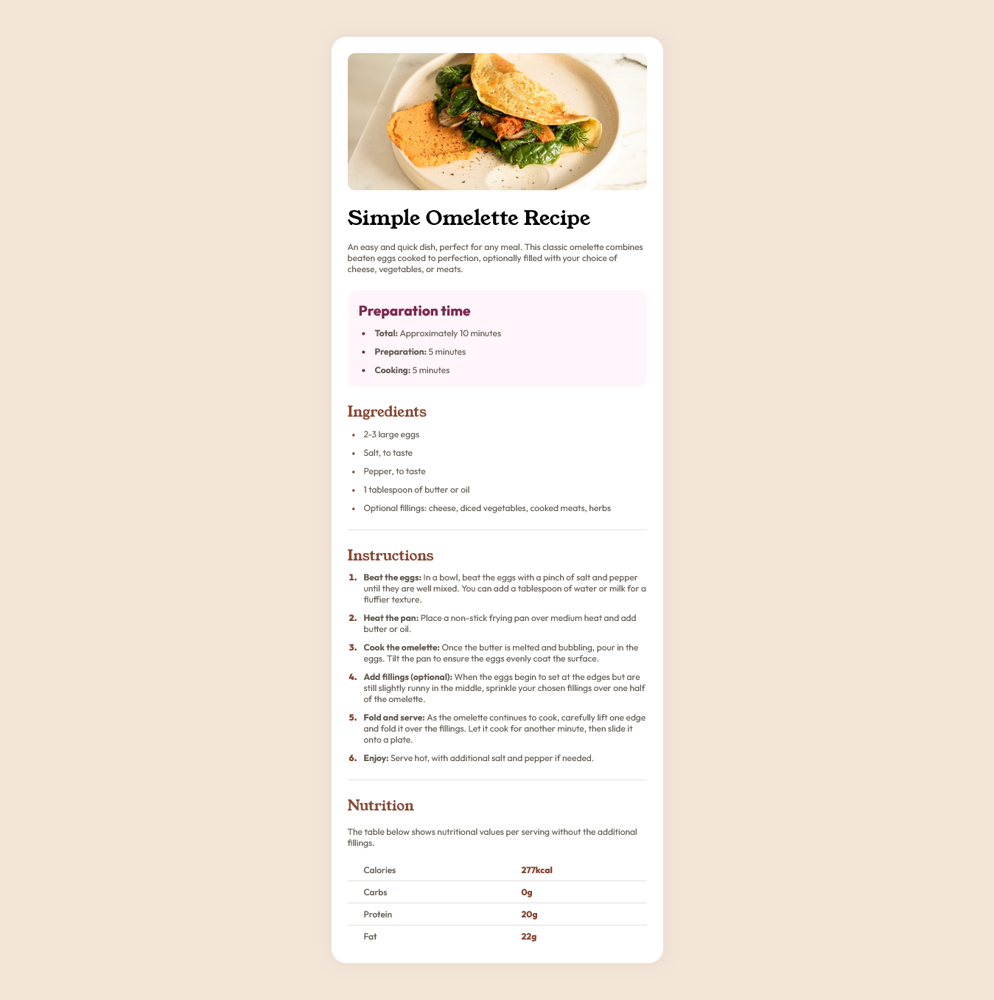

# Frontend Mentor - Recipe page solution

This is a solution to the [Recipe page challenge on Frontend Mentor](https://www.frontendmentor.io/challenges/recipe-page-KiTsR8QQKm). Frontend Mentor challenges help you improve your coding skills by building realistic projects. 

## Table of contents

- [Overview](#overview)
  - [Screenshot](#screenshot)
  - [Built with](#built-with)
  - [What I learned](#what-i-learned)
  - [Useful resources](#useful-resources)
- [Author](#author)

## Overview

### Screenshot

### Links
- Live Site URL: [https://ifehj.github.io/recipe-page/]

### Built with

- Semantic HTML5 markup
- CSS custom properties and pseudo-classes
- Flexbox
- Mobile-first workflow

### Continued development
 I'll work more on using utility classes to style elements so the code can be more readable.

## Author
- Frontend Mentor - https://www.frontendmentor.io/profile/Ifehj
